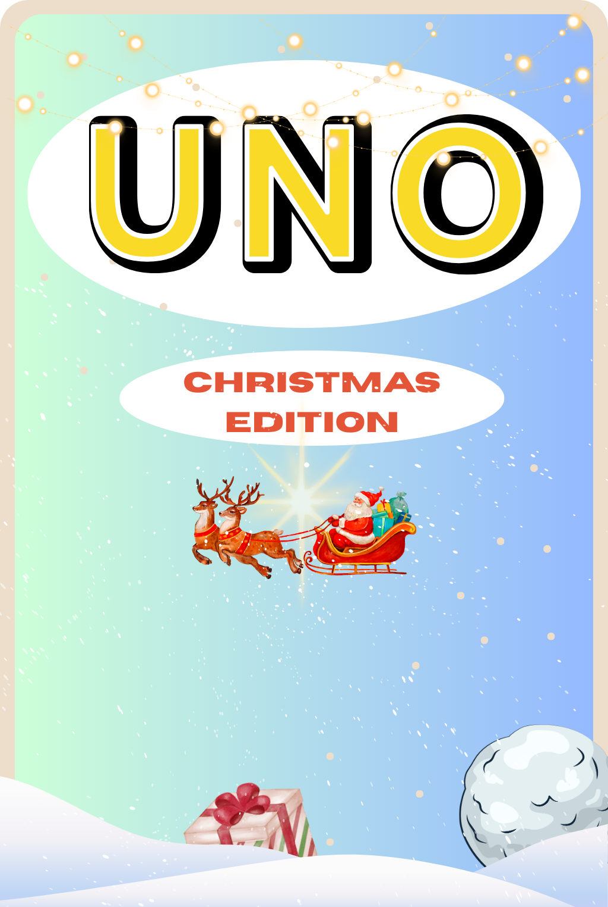

# UNO - Festive Edition

A festive twist on the classic UNO game, featuring holiday-themed cards, new special action cards, and cheerful music!

---

---

## Table of Contents
- [About the Game](#about-the-game)
- [Demo](#demo)
- [Card Types](#card-types)
- [Features](#features)
- [How to Play](#how-to-play)
- [Assets](#assets--sounds)
- [Installation & Running](#installation--running)
- [Credits](#credits)

## About the Game
UNO - Festive Edition reimagines the classic UNO card game with holiday-themed cards and new special holiday action cards. Enjoy the familiar core gameplay with a fun Christmas twist!

## Demo
👉 To play, open `index.html` in your browser. For best results, use a local server.

---

## Card Types

### Standard Cards
- **Number cards (0–9)** in four colours: 🔴 red, 🟢 green, 🔵 blue, 🟡 yellow.

### Action Cards
- 🚫 **Skip:** Next player misses a turn.
- 🔃 **Reverse:** Reverses play order. In 2-player games, acts as a skip.
- 2️⃣ **Draw Two:** Next player draws 2 cards and misses a turn.
- 🃏 **Wild Card:** Change the current colour.
- 4️⃣ **Wild Draw +4:** Change the colour and make the next player draw 4 cards.

### Special Holiday Action Cards
- ⛄ **Snowball Card:** The next player has some cards hidden and cannot see what they are.
- 🎁 **Wild Gift Card:** Choose a card from your hand to give to another player, then pick a colour.

---

## Features
- 🤖 Play against a computer
- 🔊 Sounds and music (see `SFX/` and `soundtrack/`)
- ❄️ Special holiday action cards

---

## How to Play
1. ♠️ Each player is dealt 7 cards.
2. ♥️ Match cards by colour, number, or symbol.
3. ♦️ Play action cards to gain an advantage.
4. ♣️ First player to discard all cards wins!

---

## Assets & Sounds
- **Cards:** `cards/`
- **Sound Effects:** `SFX/`
- **Music:** `soundtrack/`

---

## Installation & Running
1. ⬇️ Clone or download this repository.
2. 🔍 Find and open `index.html` in your browser.
3. 😀 Enjoy the game!

---

## Credits
- 🖥️ Game development and code: [Kieran](https://github.com/KieranPritchard)
- 🖌️ Card designs: James & Elliot
- 🎶 Sound and Music: [Arvid](https://github.com/Arvid-HU)

_Created for the BPC Hack The Halls 2025 Christmas Hackathon._

